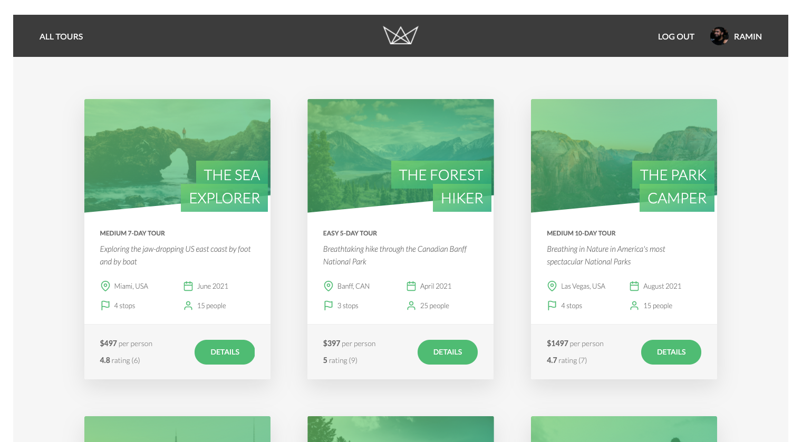

# Natours Application

Natours is a web application.
[Click here to visit](https://tours-web-app.herokuapp.com/)

## Usage example

#### Demo cards for booking test

| NUMBER              | BRAND                       | CVC          | DATE            |
| ------------------- | --------------------------- | ------------ | --------------- |
| 4242 4242 4242 4242 | Visa                        | Any 3 digits | Any future date |
| 4000 0566 5566 5556 | Visa (debit)                | Any 3 digits | Any future date |
| 4000 0566 5566 5556 | Mastercard                  | Any 3 digits | Any future date |
| 2223 0031 2200 3222 | Mastercard (2-series)       | Any 3 digits | Any future date |
| 5200 8282 8282 8210 | Mastercard (debit)          | Any 3 digits | Any future date |
| 5105 1051 0510 5100 | Mastercard (prepaid)        | Any 3 digits | Any future date |
| 3782 822463 10005   | American Express            | Any 4 digits | Any future date |
| 3714 496353 98431   | American Express            | Any 4 digits | Any future date |
| 6011 1111 1111 1117 | Discover                    | Any 3 digits | Any future date |
| 6011 0009 9013 9424 | Discover                    | Any 3 digits | Any future date |
| 3056 9300 0902 0004 | Diners Club                 | Any 3 digits | Any future date |
| 3622 7206 2716 67   | Diners Club (14 digit card) | Any 3 digits | Any future date |
| 3566 0020 2036 0505 | JCB                         | Any 3 digits | Any future date |
| 6200 0000 0000 0005 | UnionPay                    | Any 3 digits | Any future date |

## API Documentation

[Click here to get started](https://documenter.getpostman.com/view/8264761/SW7c37ZY)

## Tech

#### Built using modern technologies:

- [node.js](https://nodejs.org/)
- [Express](https://expressjs.com/)
- [mongoDB](https://www.mongodb.com/)
- [mongoose](https://mongoosejs.com/)
- **And much more 🤪**
